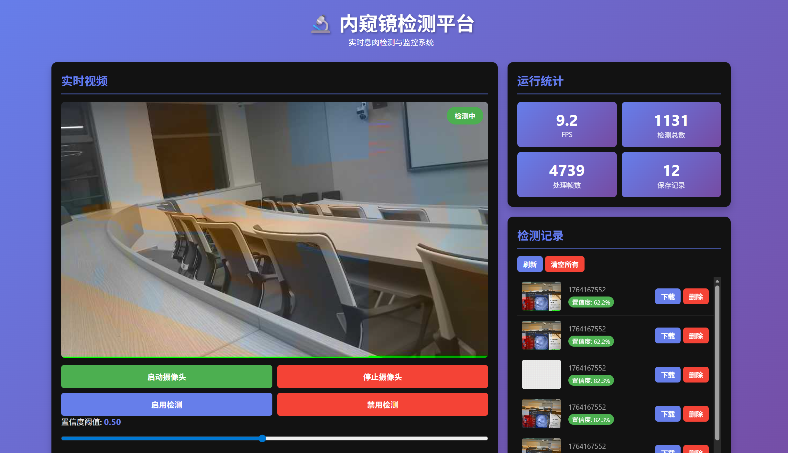

# 内窥镜息肉检测平台 (Based on K230 + RT-Smart)

这是一个基于 **嘉楠 K230 (CanMV)** 开发板的完整 **YOLOv5** 内窥镜息肉检测方案。项目采用 **C/Python 混合架构**，解决了嵌入式 Python 在高频网络视频推流下的性能瓶颈。

- **高性能网络**：C 语言编写的 HTTP/MJPEG 服务器（作为 MicroPython 内置模块运行）。
- **AI 推理**：基于 YOLOv5s 的息肉检测模型，针对 K230 KPU 优化。
- **混合编程**：Python 负责业务与 AI，C 负责底层缓冲与 I/O，实现生产与消费解耦。

---

## 📸 演示 (Demo)

.gif>)

*浏览器端实时预览（YOLO 检测 + MJPEG 推流）*


*web界面

---

## 🚀 快速开始

### 阶段 1：模型准备（PC 端）

1.  **环境准备**：参考 `docs/README_TRAINING.md` 准备 PyTorch 环境与 Kvasir-SEG 数据集。
2.  **模型训练**：运行 `scripts/training/train_endoscope_yolo.py` 训练 YOLOv5 模型。
3.  **模型转换**：使用 `scripts/conversion/export_to_kmodel_k230.ps1` 将模型转换为 K230 专用的 `.kmodel` 文件。

### 阶段 2：固件编译（关键步骤）

本项目依赖自定义的 C 语言扩展模块 (`rtsmart_web`)，**必须重新编译固件**才能运行。

1.  **源码集成**：将 `rtsmart_userapp/src` 下的 C 代码集成到 CanMV SDK 的 MicroPython 移植目录中（详见 `docs/PROJECT_DESIGN_HTTP_YOLO.md`）。
2.  **编译固件**：在 SDK 中编译生成包含自定义模块的 CanMV 镜像。
3.  **烧录**：将生成的镜像（如 `sysimage-sdcard.img`）烧录至 SD 卡。

> **注**：如果你不想自行编译，可直接使用 `build/canmv_firmware/` 目录下提供的预编译镜像（如果有）。

### 阶段 3：部署与运行（K230 设备端）

1.  **文件传输**：
    将以下文件拷贝到 K230 的 `/data/` 目录：
    *   `model.kmodel` (转换好的模型)
    *   `k230_onboard_project/` 目录下的所有 `.py` 文件

2.  **启动运行**：
    在串口终端或 IDE 中运行主程序：
    ```bash
    # 推荐使用完整版 (包含 HTTP 推流功能)
    python /data/main_http_loop.py
    ```

3.  **浏览器访问**：
    *   电脑/手机连接到 K230 所在的局域网。
    *   访问：`http://<K230_IP>:8080`
    *   MJPEG流地址：`http://<K230_IP>:8080/stream`

---

## 🏗 系统架构设计

本项目基于 **RT-Smart** 操作系统，采用 **MicroPython C Extension** 技术路线。

### 1. 核心痛点与解决
*   **痛点**：原生 Python 处理 HTTP 视频流时，Socket I/O 会抢占 CPU，且受 GIL 锁限制，导致 AI 推理掉帧严重。
*   **方案**：将 HTTP 服务器下沉到 **C 语言层**，并利用 **独立线程池** 处理网络发送。

### 2. 数据流水线 (Pipeline)

```mermaid
graph LR
    subgraph K230_Big_Core [K230 大核 (RT-Smart)]
        subgraph Python_VM [MicroPython 进程]
            A[摄像头采集] --> B[YOLO 推理]
            B --> C[OSD 绘图]
            C --> D[JPEG 压缩]
            D -->|memcpy| E((C语言环形缓冲))
        end
        
        subgraph C_Extension [Native C 线程]
            E -->|读取最新帧| F[HTTP Worker 线程]
            F -->|Socket Send| G[浏览器端]
        end
    end
```

*   **Python 层**：负责“生产”。调用 `pl.get_frame()` 采集，运行 KPU 推理，将结果画图并压缩。最后调用 `rtsmart_web.push_frame()`。
*   **C 语言层**：负责“消费”。`rtsmart_web` 模块内部维护一个环形缓冲区 (RingBuffer) 和一个 HTTP 服务器线程池。它在后台默默地将最新的 JPEG 帧推送给浏览器，**不阻塞 Python 主循环**。

---

## 📂 仓库结构说明

```text
├── Endoscope_yolov5_project/   # YOLOv5 训练工程 (PC端)
├── k230_onboard_project/       # K230 Python 应用代码 (设备端)
│   ├── main_http_loop.py       # [入口] 主程序：AI + HTTP 推流
│   ├── rtsmart_web_adapter.py  # C 扩展模块的 Python 封装层
│   └── ...
├── rtsmart_userapp/            # C 语言扩展源码 (需编译进固件)
│   ├── src/http_server.c       # Reactor 模式 HTTP 服务器
│   ├── src/frame_buffer.c      # 环形缓冲区实现
│   └── micropython_binding/    # MicroPython 绑定接口
├── scripts/                    # 训练与模型转换脚本
└── docs/                       # 设计文档与说明
```

---

## 🔌 HTTP API 接口

C 层服务器监听 **8080** 端口，提供以下接口：

| 端点 (Endpoint) | 类型 | 描述 |
| :--- | :--- | :--- |
| `/` | HTML | 静态监控主页 |
| `/stream` | Stream | MJPEG 实时视频流 (由 C 线程直接推送) |
| `/snapshot` | JPEG | 获取当前单帧截图 |
| `/api/status` | JSON | 获取当前 FPS、检测目标数等统计信息 |
| `/api/control`| JSON | 控制接口 (开关检测、调整阈值等) |

---

## 📝 常见问题 (FAQ)

**Q: 为什么运行 `main_http_loop.py` 报错 `ImportError: no module named 'rtsmart_web'`?**
A: 说明你当前运行的固件**没有**包含本项目的 C 扩展模块。必须按照 `docs` 中的指南重新编译 CanMV 固件，或者使用我们提供的预编译镜像。

**Q: AI 推理速度是多少？**
A: 使用 YOLOv5s (经过剪枝或量化后)，在 K230 上通常可达 20~30 FPS。

**Q: 视频流有延迟吗？**
A: 由于采用了环形缓冲区且策略为“总是发送最新帧”，延迟通常控制在 100ms 以内（局域网环境）。

---

## 📜 许可证

本项目代码遵循 MIT 许可证。YOLOv5 部分遵循其原有的 AGPL-3.0 许可证。数据集 Kvasir-SEG 请遵循其原始协议。