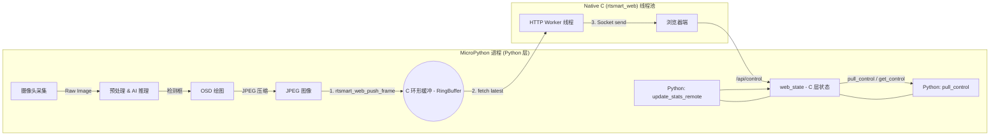
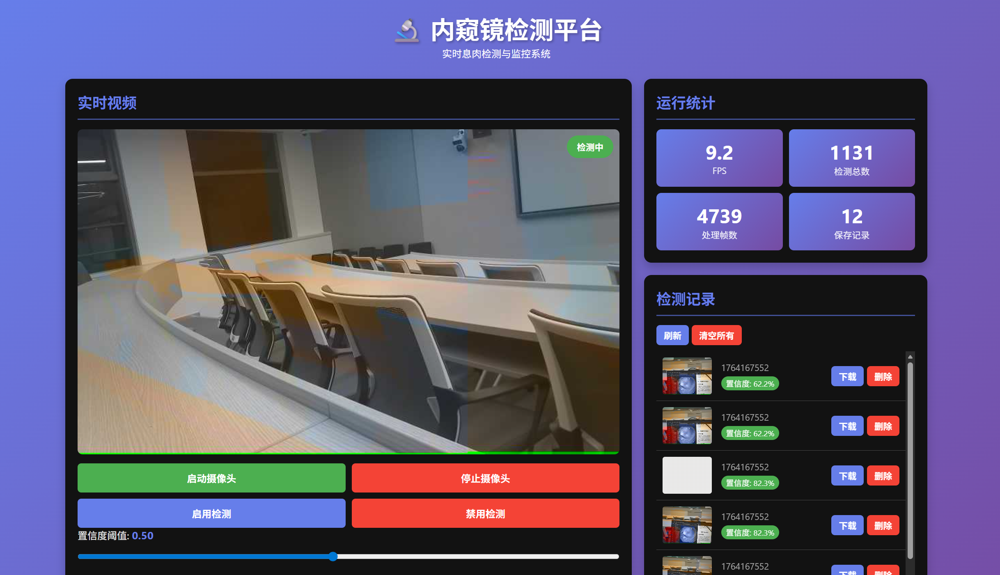

# 【项目实战】基于 K230 + RT-Smart 的内窥镜息肉检测平台设计与实现

> **摘要**：本文介绍了一个基于嘉楠 K230 开发板（RISC-V 架构）和 RT-Smart 操作系统的内窥镜息肉检测方案。采用了 **C 语言核心层 + Python 业务层** 的混合架构，通过自定义 MicroPython C 模块和环形缓冲区技术，解决了 Python 在嵌入式网络 I/O 上的性能瓶颈，实现了流畅的浏览器端实时监控与 AI 检测。
.gif>)

<
---

## 一、项目背景与痛点 

### 1.1 项目目标
本项目旨在开发一个低成本、便携式的智能内窥镜系统，包含了yolo推理和http服务器实现，能够在 K230 端侧实时检测息肉（Polyp），并通过提供http服务器界面将视频流和检测结果推送到医生端的浏览器或移动设备上。精力限制，我没有尝试研究k230驱动实际内窥镜模组，这里仅用庐山派自带镜头进行demo演示。

### 1.2 遇到的挑战
在早期的开发尝试中，我发现直接使用纯 Python（MicroPython）实现 HTTP 视频流服务器存在明显问题：
1.  **GIL 限制**：MicroPython 的全局解释器锁（GIL）导致网络发送（I/O 密集型）与 AI 推理（计算密集型）无法并行，视频卡顿严重。
2.  **调度开销**：在处理高频 Socket 请求时，Python 虚拟机的解释执行效率较低，抢占了 NPU 推理的 CPU 时间片。

### 1.3 解决方案
为了解决上述问题，我们设计了 **C/Python 混合架构**：
*   **计算密集/业务逻辑**：保留在 **Python** 层，利用 CanMV 封装好的 `PipeLine` 和 `YOLO` 接口，开发效率高。
*   **I/O 密集/高性能网络**：下沉到 **C 语言** 层，利用 RT-Smart 的多线程机制实现 HTTP Server 和 MJPEG 推流。
*   **跨语言通信**：通过编写 C Extension（扩展模块）打通两者，实现数据的高效传递。

---

## 二、系统架构设计 
硬件部分仅庐山派，故不做展开。下面讲解软件部分。

### 2.0 YOLOv5 模型简介

本项目使用 YOLOv5 的轻量级变体（`yolov5s`）作为检测骨干网，针对内窥镜息肉（polyp）场景做了迁移学习与微调。息肉数据集下载自https://www.kaggle.com/datasets/fkarimovv/kvasir-seg，用脚本处理为yolo格式（见 `datasheet/Kvasir-SEG-YOLO`），模型为单类（`polyp`），并在训练阶段基于 Ultralytics 的训练流水线（`Endoscope_yolov5_project/train.py`）使用预训练权重进行微调以提高样本效率。训练完成后通过 `export.py` 等工具导出模型，并使用 nncase（示例脚本：`test_yolov5/segment/to_kmodel.py`）转换为 K230 可用的 `.kmodel` 格式，最终放入开发板并由 `k230_onboard_project` 通过 `kmodel_path` 加载运行。鉴于 K230 的资源限制，选择 `yolov5s` 在精度与实时推理速度之间做了折中，以确保边缘端的实时检测能力。

### 2.1 整体分层架构

项目代码仓库（参考 [GitHub](https://github.com/Passionate0424/Endoscope_yolo)），主要分为两大部分：

1.  **RT-Smart C 核心层 (`rtsmart_userapp/`)**
    *   负责 Socket 通信、HTTP 协议解析、MJPEG 封包。
    *   维护一个**环形帧缓冲区 (Ring Frame Buffer)**，平滑视频流。
2.  **MicroPython 应用层 (`k230_onboard_project/`)**
    *   负责摄像头采集、YOLOv5 推理、OSD 绘图。
    *   通过自定义模块 `rtsmart_web` 将图像帧“推”给 C 层。

### 2.2 数据流水线 (Data Pipeline)



这种架构实现了**生产与消费的解耦**：Python 只需要把图扔进缓冲区就可以继续下一帧推理，不用等待缓慢的网络发送完成。

---

## 三、关键技术实现细节

### 3.1 C 语言 HTTP 服务器与线程池

为了最大化利用 K230 的性能与资源，C 层服务器采用了 **Reactor 模式** 的变种：

*   **Accept 线程**：只负责监听端口（8080）和接受连接，将新的客户端 Socket 放入任务队列。
*   **Worker 线程池**：预先创建固定数量（如 4 个）的线程，从队列中抢占任务。


**关键代码 (`http_server.c`)：**
```c
// 简化的 Worker 线程逻辑
while (1) {
    // 1. 等待任务信号量
    sem_wait(&queue_sem); 
    
    // 2. 从队列取出一个客户端连接
    pthread_mutex_lock(&queue_lock);
    client_ctx_t ctx = queue_pop();
    pthread_mutex_unlock(&queue_lock);
    
    // 3. 处理业务（推流或API响应）
    client_handler_thread(&ctx);
}
```
这种设计避免了为每个 HTTP 请求频繁创建/销毁线程的开销，在嵌入式系统资源受限的环境下尤为重要。

### 3.2 环形帧缓冲区 (Ring Frame Buffer)

这是解决视频卡顿的核心组件。我们在 C 层开辟了一块连续内存，分割成 N 个槽位（Slots）。

*   **写策略（Python 端）**：总是写入最新的槽位。如果缓冲区满了，覆盖最旧的帧（保证实时性）。
*   **读策略（HTTP 端）**：总是读取最新的完整帧。

**代码实现 (`frame_buffer.c`)：**
```c
int frame_buffer_push(const uint8_t *jpeg_data, size_t size) {
    rt_mutex_take(&g_buffer_mutex, RT_WAITING_FOREVER);
    
    // 写入当前写指针指向的槽位
    frame_slot_t *slot = &g_frame_buffer.slots[g_frame_buffer.write_idx];
    memcpy(slot->data, jpeg_data, size);
    slot->size = size;
    slot->valid = 1;
    
    // 指针后移，通过取模实现环形回绕
    g_frame_buffer.write_idx = (g_frame_buffer.write_idx + 1) % MAX_FRAME_SLOTS;
    
    rt_mutex_release(&g_buffer_mutex);
    return 0;
}
```

### 3.3 Python C Extension (绑定层)

为了能方便的使用canMV封装好的yolo推理框架，我们采取将c层封装为micropython接口的方法我们需要遵循 MicroPython 的模块定义规范编写绑定代码。

**绑定实现 (`rtsmart_web_module.c`)：**
```c
// 定义 Python 可调用的函数 rtsmart_web.push_frame(bytes)
STATIC mp_obj_t rtsmart_web_push_frame(mp_obj_t jpeg_bytes_obj) {
    mp_buffer_info_t bufinfo;
    // 获取 Python bytes 对象的内存地址和长度
    mp_get_buffer_raise(jpeg_bytes_obj, &bufinfo, MP_BUFFER_READ);
    
    // 调用 C 核心函数
    frame_buffer_push((const uint8_t *)bufinfo.buf, bufinfo.len);
    
    return mp_const_none;
}
// 将函数注册到模块表
STATIC const mp_rom_map_elem_t rtsmart_web_module_globals_table[] = {
    { MP_ROM_QSTR(MP_QSTR_push_frame), MP_ROM_PTR(&rtsmart_web_push_frame_obj) },
    // ... 其他接口
};
```
通过这种方式，Python 端的 `push_frame` 操作几乎等同于一次 C 语言的 `memcpy`，效率极高。

---

## 四、CanMV Python 层代码

Python 层主要由 `k230_onboard_project` 目录下的代码组成。

本项目的 Python 代码采用 **单线程事件循环（Event Loop）** 的设计模式，在一个 `while True` 循环中串行处理 **图像采集**、**AI 推理**、**视频推流** 和 **指令响应** 四大任务。

### 4.1 核心入口：`main_http_loop.py`

整个程序的入口文件，其核心逻辑可以概括为：**初始化硬件 -> 启动 C 服务 -> 进入无限循环**。

#### 1. 初始化阶段
在进入循环前，我们需要准备好所有资源：

```python
# [代码片段] 初始化逻辑
def main():
    # 1. 连接网络 (这是 Web 控制的前提)
    connect_wifi(WIFI_SSID, WIFI_PASSWORD)
    
    # 2. 启动底层 C 语言 HTTP 服务器
    # rtsmart_web 是我们编写的 C 扩展模块
    import rtsmart_web
    rtsmart_web.start_server() 

    # 3. 初始化 Web 适配器 (封装了与 C 层的交互)
    # quality=50 表示推流时的 JPEG 压缩质量，平衡清晰度与带宽
    web = RTWebAdapter(quality=50, use_http_api_for_control=False)

    # 4. 初始化 Pipeline (K230 媒体流管线)
    # 负责配置 Sensor、ISP、Display 等底层硬件
    pl = PipeLine(rgb888p_size=RGB888P_SIZE, display_mode=DISPLAY_MODE)
    pl.create()

    # 5. 加载 YOLO 模型
    # anchors 是 YOLO 检测框的锚点配置
    yolo = YOLOv5(debug_mode=0, kmodel_path="/data/best.kmodel", anchors=[...])
```

#### 2. 主循环阶段 (The "Heartbeat")

为了避免多线程带来的 GIL 锁竞争问题，我们采用**顺序执行**的方式。这意味着循环中的每一步都必须足够快，否则会拖慢整体帧率。

```python
    # [代码片段] 主循环逻辑
    try:
        while True:
            # --- 步骤 A: 获取硬件图像 ---
            # 从 PipeLine 获取一帧原始数据
            frame = pl.get_frame()

            # --- 步骤 B: AI 推理 (核心业务) ---
            if detection_enabled:
                # 运行 YOLO 模型，返回检测结果列表 (box, class, score)
                results = yolo.run(frame)
                
                # 将检测框绘制在 OSD (On-Screen Display) 层上
                # 注意：是在 pl.osd_img 上画，而不是破坏原始 frame
                yolo.draw_result(results, pl.osd_img)
                
                # (可选) 如果置信度高，自动保存截图作为“病历记录”
                save_detection_records(results, ...)

            # --- 步骤 C: 本地显示 ---
            # 将处理后的画面显示在开发板连接的屏幕上
            pl.show_image()

            # --- 步骤 D: 网络推流 (关键交互) ---
            if stream_enabled:
                # 获取用于推流的图像 (通常是叠加了检测框的画面)
                stream_img = get_stream_image(pl, detection_enabled)
                
                # 【重点】调用适配器，将图像压缩并“推”给 C 层
                web.update_frame(stream_img)

            # --- 步骤 E: 同步状态与指令 ---
            # 1. 将当前的 FPS 和检测总数告诉 C 层 (供 /api/status 使用)
            web.update_stats_remote(total_frames, total_detections, fps)
            
            # 2. 从 C 层“拉取”前端发来的控制指令 (如点击了“开启检测”按钮)
            ctrl = web.pull_control()
            if ctrl: 
                # 解析指令并更新 Python 端的全局变量
                apply_control(ctrl)

            # --- 步骤 F: 内存回收 ---
            # 嵌入式系统内存有限，每帧强制回收垃圾对象，防止 OOM (Out Of Memory)
            gc.collect()

    except Exception as e:
        sys.print_exception(e)
    finally:
        # 清理资源
        pl.destroy()
```

关于如何从CanMV封装好的Pipeline类中获取图片，我研究了好久，参考[官方api手册](https://www.kendryte.com/k230_canmv/zh/main/zh/api/aidemo/PipeLine%20%E6%A8%A1%E5%9D%97%20API%20%E6%89%8B%E5%86%8C.html)中的描述，使用pl.get_frame()返回的格式为ulab.numpy.ndarray，并不能直接创建image对象。这里参考了这篇博客[K230保存YOLO大作战图片踩坑笔记](https://blog.csdn.net/weixin_42610887/article/details/146985975),可以采用sensor启用两个通道的方式，一个通道用于yolo推理，另一通道用于保存图片，而进一步查阅api手册发现Pipeline本身就开启了两路通道，而且分析其源码(https://github.com/kendryte/canmv_k230/blob/canmv_k230/resources/libs/PipeLine.py),Pipeline包含了sensor对象，可以直接调用snapshot方法获取图片。
在这里用YUV格式的通道0获取图片

```python
from media.sensor import CAM_CHN_ID_0
    stream_img = pl.sensor.snapshot(chn=CAM_CHN_ID_0)
```
后续用image对象的compress方法获取jpg用于MJPEG传输。

---

### 4.2 c层适配器：`rtsmart_web_adapter.py`

该类实现了典型的适配器模式，旨在构建 Python 应用层与 C 扩展层之间的通信桥梁。它通过封装底层数据类型转换与接口调用细节，屏蔽了跨语言交互的复杂性，从而实现了业务逻辑与底层驱动的有效解耦，确保主控制循环专注于核心流程。

#### 核心功能 1：智能推帧与压缩 (`update_frame`)
C 层的 `rtsmart_web.push_frame` 只接受 JPEG 格式的 `bytes` 数据，而 K230 的摄像头输出通常是 `image.Image` 对象。适配器负责转换：

```python
    def update_frame(self, image):
        # 1. 速率限制 (Throttling)
        # 如果推流太快 (如 >30ms 一次)，浏览器处理不过来，主动丢弃该帧
        now_ms = int(time.time() * 1000)
        if (now_ms - self._last_push_time) < self._min_push_interval_ms:
            return

        # 2. 格式转换与压缩
        if isinstance(image, (bytes, bytearray)):
            # 如果已经是字节流，直接发送
            rtsmart_web.push_frame(image)
        elif hasattr(image, 'compress'):
            # 如果是 Image 对象，调用 compress 方法转为 JPEG
            # quality 参数决定了画质与体积的平衡
            jpeg_bytes = image.compress(quality=self.quality)
            rtsmart_web.push_frame(jpeg_bytes)
        
        self._last_push_time = now_ms
```

#### 核心功能 2：指令同步 (`pull_control`)
浏览器发送的指令（如 `/api/control?detection=1`）会先存储在 C 层的 `web_state` 结构体中。Python 端需要定期“轮询”这些变化。

```python
    def pull_control(self):
        # 1. 调用 C 扩展接口获取当前状态字典
        # 返回格式如: {'camera': 1, 'detection': 0, 'confidence': 0.5}
        ctrl_info = rtsmart_web.get_control()
        
        # 2. 对比本地状态，返回差异部分
        # (此处逻辑经过简化，实际代码包含版本号比对)
        return ctrl_info
```

---


### 4.3 设计总结

1.  **单线程 vs 多线程**：
    在 `main_http_loop.py` 中，我们没有为推流单独开辟 Python 线程。因为 MicroPython 的 GIL 锁会导致线程切换开销巨大。我们将耗时的“网络发送”动作交给 C 语言线程（在 `rtsmart_web` 内部），Python 主线程只负责“准备数据”，实现了**“Python 生产，C 消费”**的高效模式。

2.  **显式 GC (`gc.collect`)**：
    在 `while True` 循环末尾调用 `gc.collect()` 是嵌入式 Python 开发的“黄金法则”。处理高分辨率图像时，内存碎片化非常快，显式回收能保证长时间运行不崩溃。

3.  **异常捕获 (`try-except`)**：
    主循环包裹在 `try-except` 中，确保即使发生网络错误或传感器故障，程序也能打印错误日志并尝试安全退出（`pl.destroy()`），避免硬件资源处于未释放的僵死状态。

---

## 五、部署与效果展示 
### 5.1 固件集成与构建指南 

由于本项目引入了自定义的 C 语言扩展模块 (`rtsmart_web`)，我们需要修改 K230 的 MicroPython 源码构建脚本，将 C 核心层代码编译进固件中。以下是详细步骤：

#### 1. 环境与源码准备
推荐使用 WSL (Ubuntu 20.04) 环境。确保你已经拉取了 CanMV-K230 的官方 SDK，并下载了本项目的源码。

```bash
# 假设 SDK 位于 ~/k230_sdk
# 本项目源码位于 ~/Endoscope_yolo
cd ~/k230_sdk
source tools/get_download_url.sh && make dl_toolchain # 下载编译工具链
```

#### 2. 迁移 C 核心层源码
我们需要将项目中的 C 语言源文件复制到 SDK 中 MicroPython 的移植目录 (`src/canmv/port`)，使其能够被构建系统识别。

```bash
# 目标路径: src/canmv/port/
# 复制源文件
cp ~/Endoscope_yolo/rtsmart_userapp/src/*.c src/canmv/port/
cp ~/Endoscope_yolo/rtsmart_userapp/src/*.h src/canmv/port/
```

#### 3. 修改构建脚本 (Makefile Integration)
这是最关键的一步。我们需要编辑 `src/canmv/port/Makefile`，告知编译器编译我们的文件并启用特定宏。

打开 `src/canmv/port/Makefile`，找到定义源文件列表的地方，添加以下内容：

```makefile
# --- [Endoscope Project Integration Start] ---

# 1. 添加源文件到 SRC_C 列表
# 确保包含核心服务、RingBuffer、状态管理及 Python 绑定模块
SRC_C += \
    http_server.c \
    http_handler.c \
    frame_buffer.c \
    web_state.c \
    static_assets.c \
    micropython_binding/rtsmart_web_module.c

# 2. 添加编译宏定义
# RTSMART_WEB_PORTABLE: 启用兼容 MicroPython 的线程池实现（POSIX 兼容模式）
CFLAGS += -DRTSMART_WEB_PORTABLE

# HTTP_SERVER_FORCE_PORTABLE: 强制使用 portable 模式（可选，视具体逻辑而定）
CFLAGS += -DHTTP_SERVER_FORCE_PORTABLE

# --- [Endoscope Project Integration End] ---
```

#### 4. 执行编译
配置完成后，在 SDK 根目录执行编译命令。

```bash
# 1. 配置板级参数 (选择庐山派 LCKFB 配置)
make list-def
make k230_canmv_lckfb_defconfig

# 2. 开始编译 (生成 SD 卡镜像)
# 这一步会编译 OpenSBI, U-Boot, Linux Kernel 以及包含我们修改的 MicroPython
make
```

#### 5. 烧录与部署
编译成功后，在 `output/k230_canmv_lckfb_defconfig/images/` 目录下会生成编译好的固件。

1.  **烧录**：使用 Etcher 或 Win32DiskImager 将镜像写入 SD 卡。
2.  **上传代码**：开发板启动后，将本项目 Python 目录 (`k230_onboard_project/`) 下的所有 `.py` 文件复制到开发板的 `/data/` 分区。
3.  **运行**：
    ```python
    import main_http_loop
    main_http_loop.main()
    ```

---

### 5.2 浏览器端体验
打开浏览器访问 `http://<K230_IP>:8080`：
*   **首页**：可以看到带有 YOLO 检测框的实时画面。
*   **控制面板**：可以动态调整 `Confidence` 阈值，控制摄像头开关。
*   **API**：访问 `/api/status` 返回 JSON 格式的帧率统计和检测数据。

效果如下


---

## 六、结语与展望

本项目通过 **C/Python 混合编程**，在 K230 平台上成功实现了一套高性能的内窥镜检测系统。

*   **对于嵌入式开发者**：展示了如何利用 RT-Smart 的多线程能力弥补 MicroPython 的性能短板。
*   **对于 AI 开发者**：提供了一套完整的从模型部署（KModel）到 Web 可视化的参考方案。

可扩展部分：http服务器可以继续提供上传图片接口，完全打造成内窥镜息肉检测在线平台，既可以利用k230连接内窥镜镜头实时监测，也可以实现上传图片远程检测。
CanMV提供的ai2d部分提供了不少isp处理接口，可以对画面质量进行进一步处理，在医疗图像领域有较大潜力。

---

*项目开源地址：[GitHub - Passionate0424/Endoscope_yolo](https://github.com/Passionate0424/Endoscope_yolo)*